# 幽邃地窟粘鼠板

## 大致思路

## 阵容优劣势

## 防守方

### 手枪局

### antieco

### eco

### 长枪局

### 变式

### 前压与反清

## 进攻方

### 手枪局

#### normal

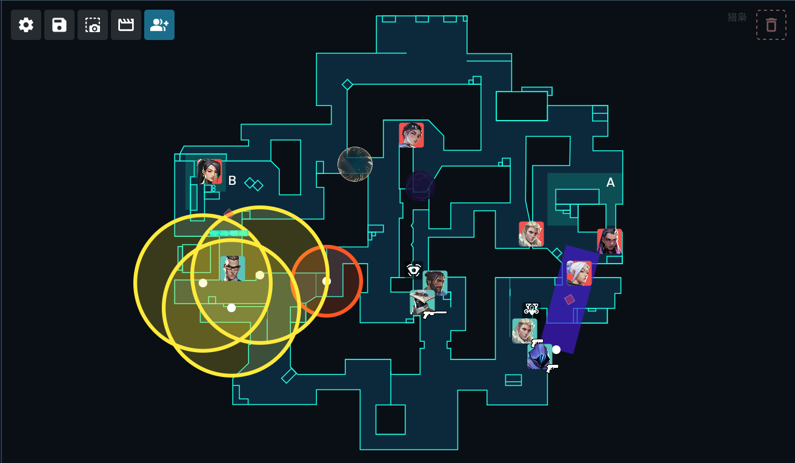

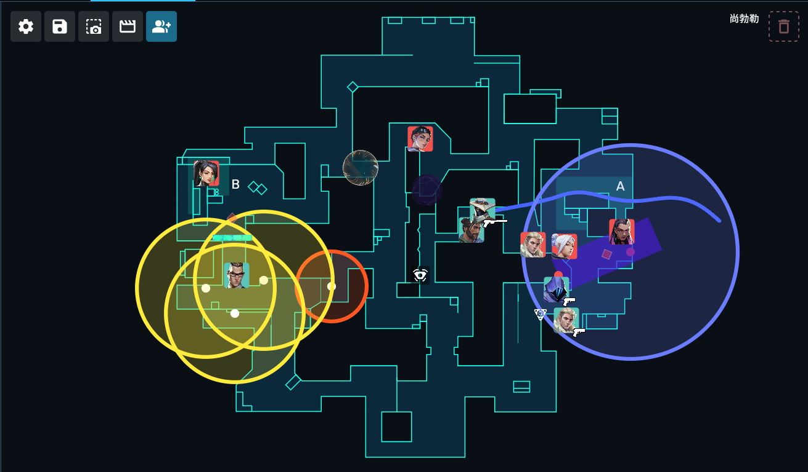

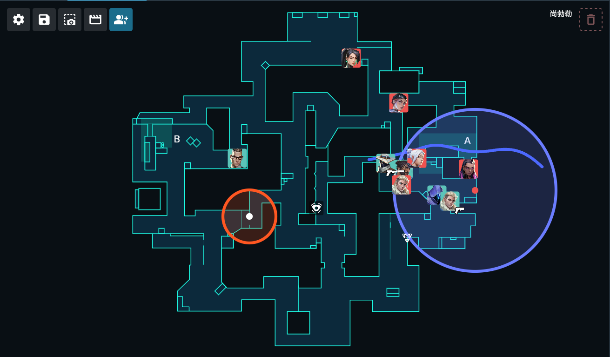

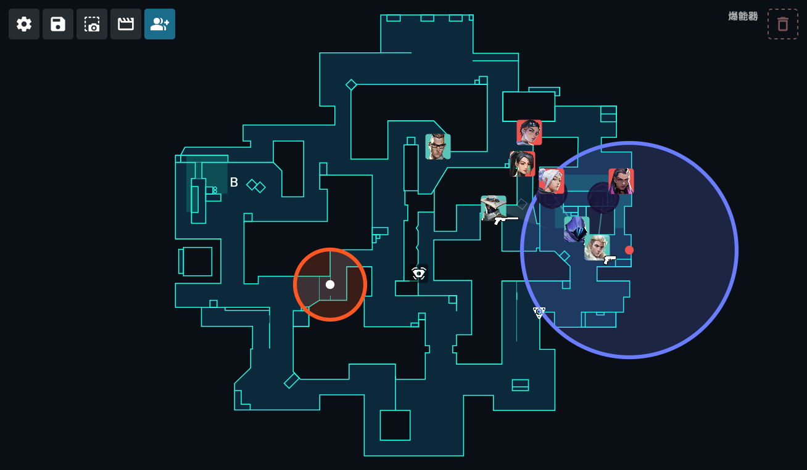

### antieco

### eco

### 长枪局

### 变式

### 反控

#### 手枪局反控a大

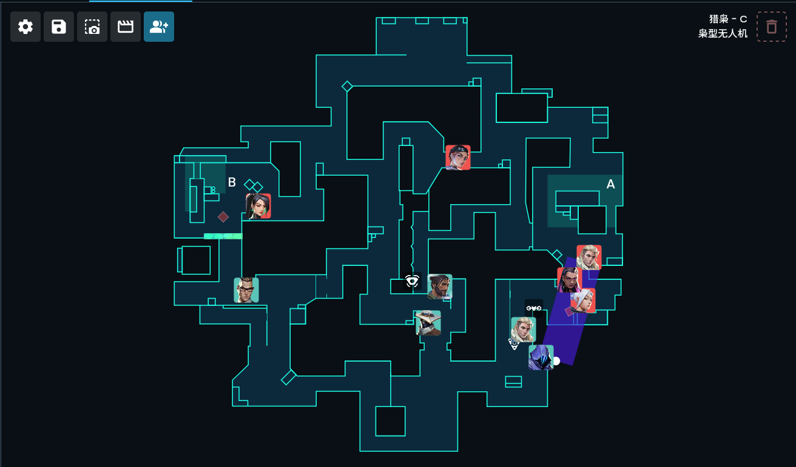

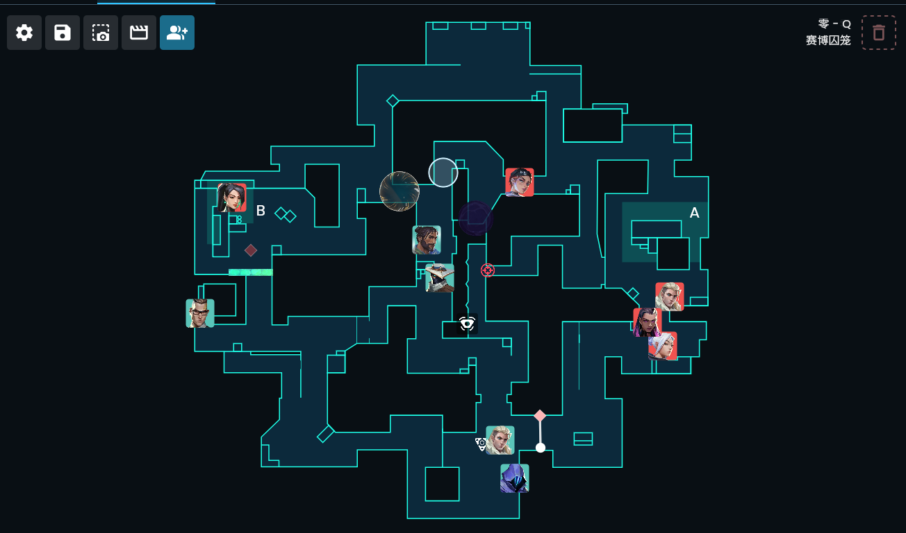

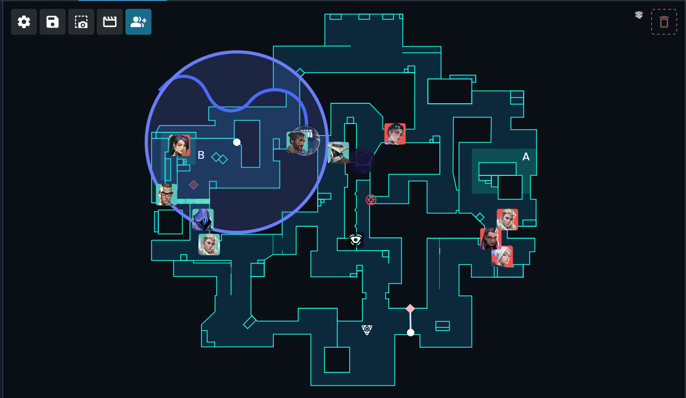

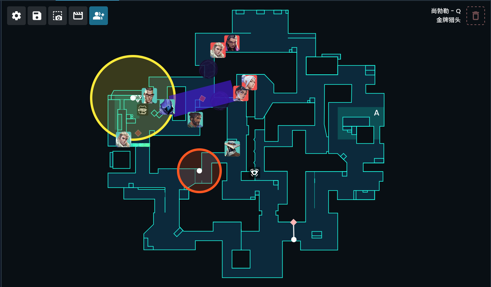

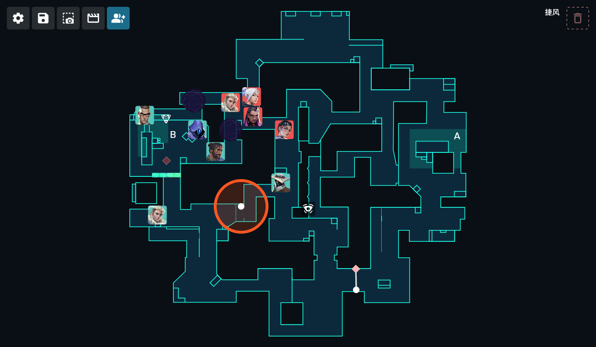

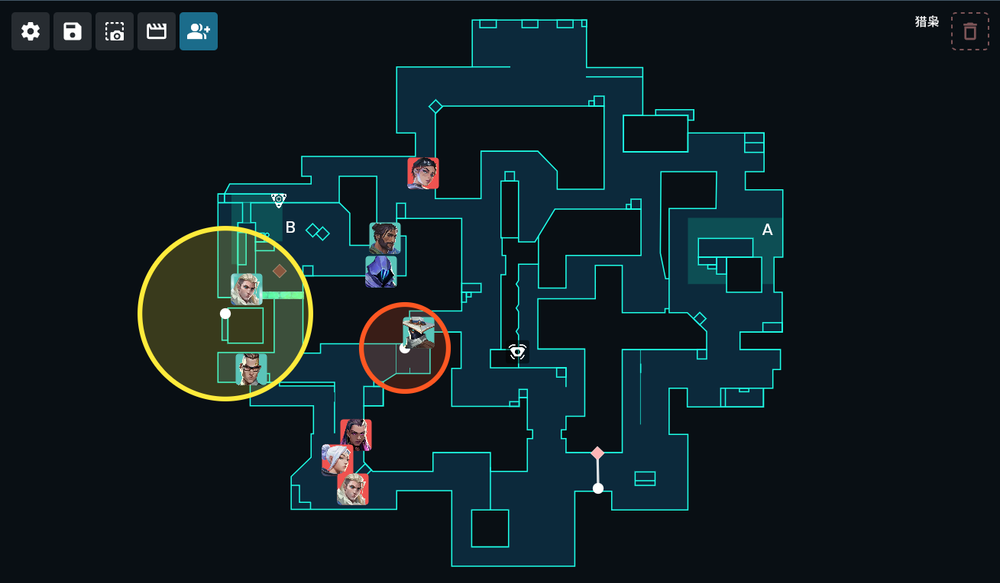

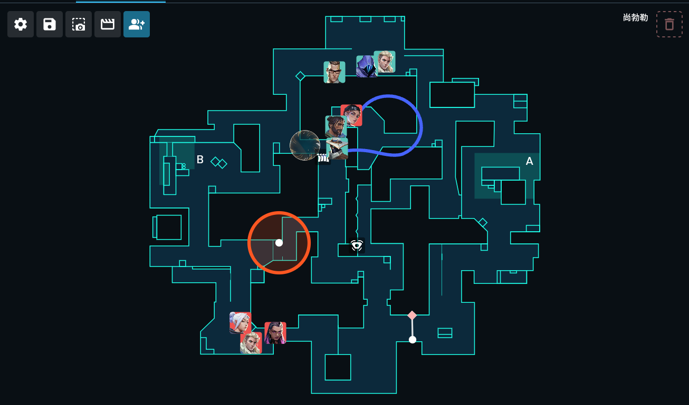

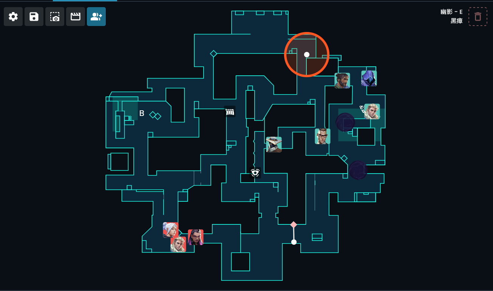

## 一些思考
